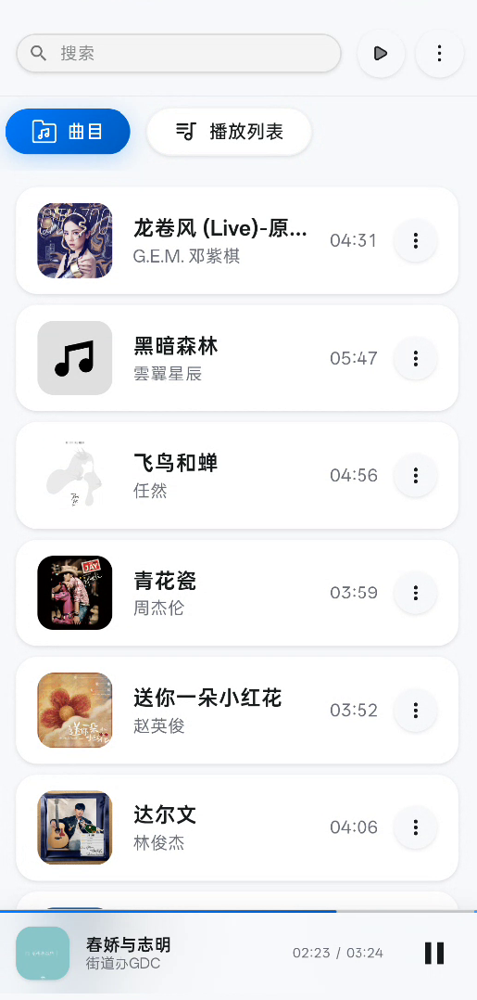
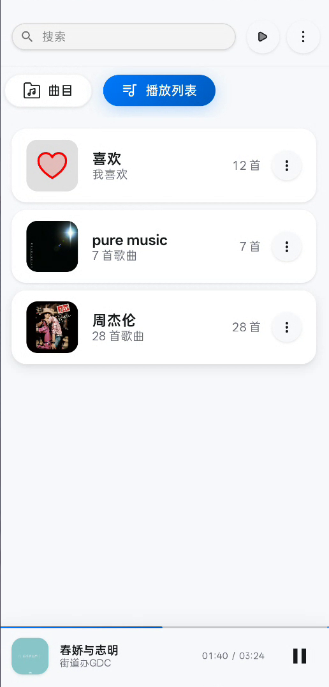
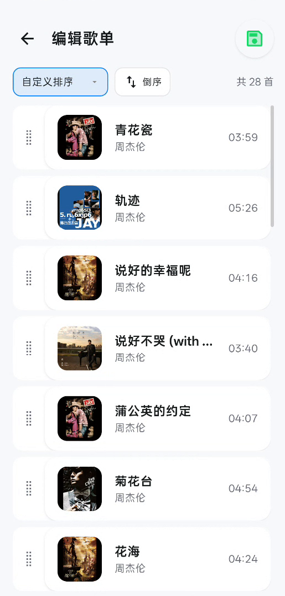
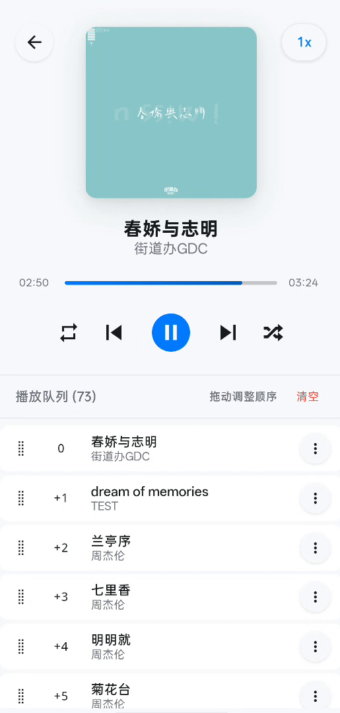
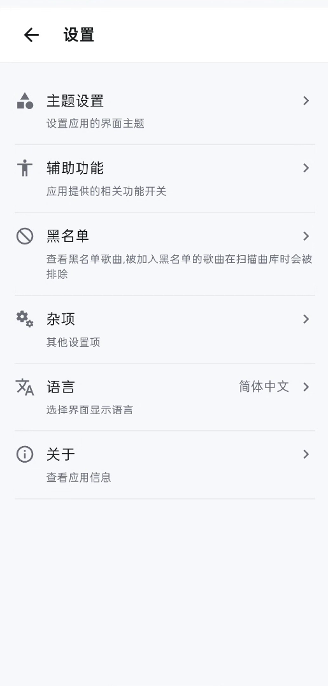
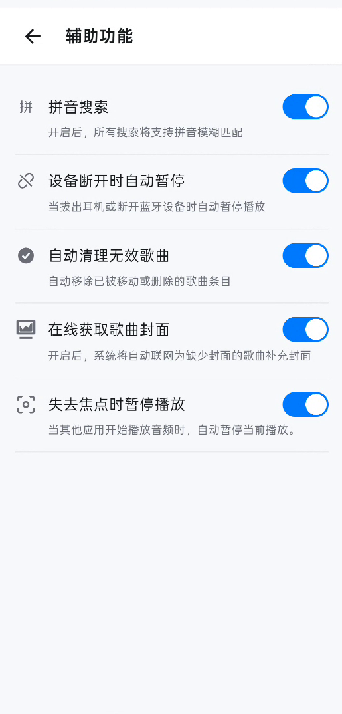

# Melodio

[](LICENSE) [](https://developer.android.com) -green>)

[🇨🇳 中文](./docs/chinese/README.md)

A smooth, minimalist music player built for Android. Built with Ionic Vue and Capacitor, it supports offline playback of local audio files, providing a clean playback experience, lock screen media controls, and comprehensive background playback capabilities.

## 📱 System Requirements

| Item                | Description                  |
| ------------------- | ---------------------------- |
| **Platform**        | Android                      |
| **Minimum Version** | Android 7.0 (Nougat, API 24) |
| **Target Version**  | Android 15 (API 36)          |
| **Architectures**   | ARM64, ARMv7, x86_64         |

> Currently only Android is supported.

## ✨ Features

### 🎵 Music Playback

- **Local Music Scanning** – Automatically scans audio files on device storage, supports FLAC, MP3, AAC, WAV, OGG and other mainstream formats
- **Native Playback Engine** – Custom Capacitor plugin utilizing Android MediaPlayer + MediaSession for stable and smooth playback
- **Background Playback** – Continues playing even when the app is in the background, with full media controls in the notification shade
- **Lock Screen / Notification Controls** – Displays cover art, track info, progress bar; supports play/pause, previous/next, and seek
- **Playback Speed** – One‑tap speed toggle (0.5x ~ 2.0x) on the player screen
- **Playback Modes** – Supports sequential and single‑track repeat, with loop logic efficiently handled natively
- **Wired / Bluetooth Button Support** – Responds to media buttons from wired headsets and Bluetooth devices (play/pause, previous, next)

### 📋 Play Queue

- **Queue Management** – Add to queue, play next, or remove from queue
- **Drag‑and‑Drop Sorting** – Long‑press and drag to reorder the queue
- **Clear Queue** – One‑tap to clear the entire playback queue

### 🎤 Playlist System

- **Custom Playlists** – Create, rename, and delete playlists
- **Batch Operations** – Multi‑select tracks and batch‑add them to playlists, the queue, or the blacklist
- **Smart Sorting** – Sort by title, artist, date added, or date modified, with ascending/descending order and custom drag‑and‑drop sorting
- **"Favourites"** – A built‑in default playlist for one‑tap collection of favourite songs

### 🎨 Album Artwork

- **Embedded Artwork First** – Prioritises reading embedded album art from audio files
- **Online Search** – Automatically searches for artwork (via iTunes API) when none is embedded and caches it locally
- **Offline Availability** – Cached artwork remains available even without network connectivity

### 🌓 User Interface

- **Dark Mode** – Supports light/dark theme switching, with system‑follow or manual selection
- **Multilingual** – Provides Simplified Chinese and English interfaces, automatically following the system language
- **Pinyin Search** – Supports fuzzy pinyin matching; you can quickly find songs by typing the first letters of pinyin
- **System Bar Adaptation** – Status and navigation bar colours automatically adapt to the current theme, ensuring clear icons in both light and dark modes
- **Haptic Feedback** – Gentle vibration feedback for key actions

### ⚙️ Accessibility & Intelligence

- **Auto‑Pause on Headphone/Bluetooth Disconnect** – Automatically pauses playback when headphones are unplugged or Bluetooth devices are disconnected, preventing accidental loudspeaker playback
- **Audio Focus Management** – Automatically pauses when another app starts playing audio to avoid audio conflicts
- **Auto‑Clean Invalid Songs** – Automatically removes entries for songs that have been moved or deleted
- **Scanning Blacklist** – Allows you to blacklist specific songs so they are excluded from future library scans

### 💾 Data Management

- **Backup** – One‑tap export of all data (song info, playlists, settings, etc.) to a JSON file
- **Restore** – Import data from a JSON file (note: this will overwrite current data)

## 📸 Screenshots

<div align="center">

### Home & Library

<div style="display: flex; justify-content: center; flex-wrap: wrap; gap: 12px; margin-bottom: 20px;">
  <div>
    
    <p><em>All Tracks</em></p>
  </div>
  <div>
    
    <p><em>Playlist</em></p>
  </div>
  <div>
    
    <p><em>Playlist Sorting</em></p>
  </div>
</div>

### Player

<div style="display: flex; justify-content: center; flex-wrap: wrap; gap: 12px; margin-bottom: 20px;">
  <div>
    
    <p><em>Player Interface</em></p>
  </div>
</div>

### Settings & Utilities

<div style="display: flex; justify-content: center; flex-wrap: wrap; gap: 12px; margin-bottom: 20px;">
  <div>
    
    <p><em>Settings</em></p>
  </div>
  <div>
    
    <p><em>Accessibility</em></p>
  </div>
</div>

</div>

## 🛠 Technology Stack

- **Frontend Framework**: Vue 3 + TypeScript + Vite
- **Mobile**: Ionic Vue 8 + Capacitor 8
- **Native Audio**: Custom Capacitor plugin (Java) using Android MediaPlayer + MediaSession + `androidx.media`
- **State Management**: Pinia
- **Internationalisation**: vue-i18n
- **Icons**: Iconify (Material Design Icons)
- **Styling**: SCSS
- **Pinyin Search**: pinyin-match

## 🚀 Build & Run

### Prerequisites

- Node.js >= 18
- Android Studio (latest stable), VS Code
- Android SDK (API 24+)
- Java JDK 17+

### Development Steps

```bash
# Install dependencies
npm install

# Sync Capacitor native project
npx cap sync
```

Build and open in Android Studio:

```bash
# Build frontend and sync to Android project
npm run android:build

# Open in Android Studio
npx cap open android

# Or use the following one‑liner to build frontend and open in Android Studio
npm run android:dev
```

## 📄 License

This project is open‑source under the [Apache License Version 2.0](./LICENSE).
