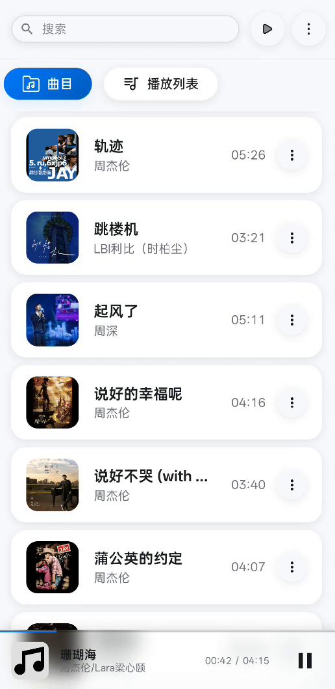
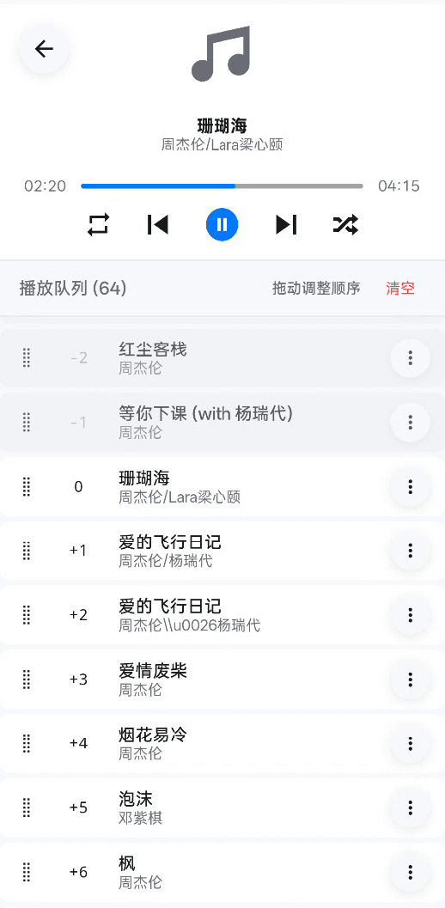
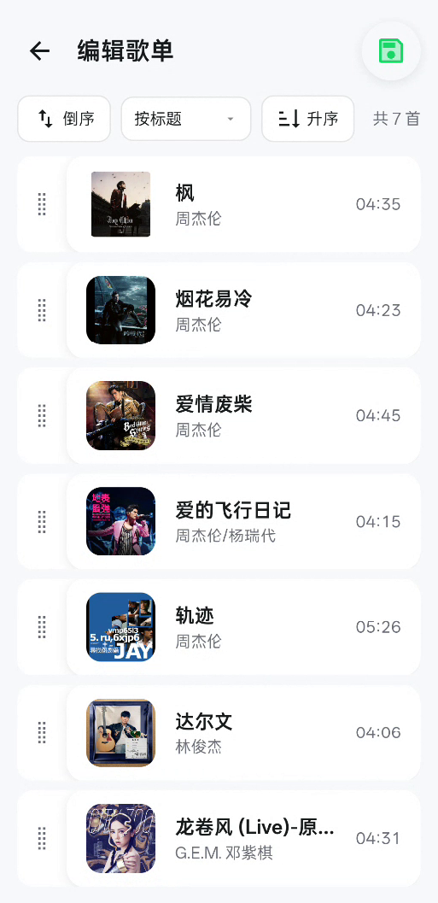
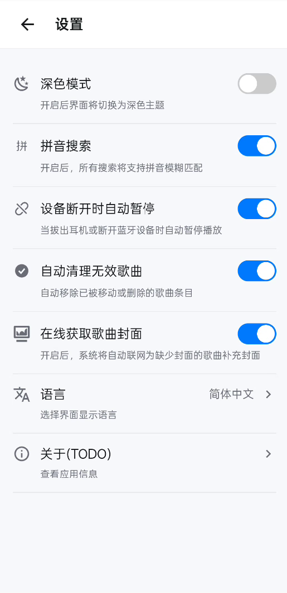

# Melodio

一个平滑的、支持离线使用的音乐播放器，基于 Ionic Vue 和 Capacitor 构建。它可以扫描您设备上的本地音频文件，提供清爽的播放体验、锁屏媒体控件以及完善的后台播放能力。

## ✨ 功能特性

- **本地音乐扫描与播放** – 自动检测设备存储中的音频文件，支持 FLAC、MP3、AAC 等常见格式
- **原生播放引擎** – 通过自定义 Capacitor 插件使用 Android MediaPlayer，实现稳定的后台播放和自动切歌
- **锁屏/通知栏控件** – 提供完整的媒体通知，包含封面、进度条、播放/暂停、上一首/下一首、拖动进度等
- **播放队列管理** – 支持拖拽排序、插入下一首播放、添加到队列、清空队列、随机播放
- **单曲循环与顺序播放** – 可一键切换播放模式，原生层高效处理循环逻辑
- **智能封面获取** – 优先使用本地内嵌封面，无封面时自动联网搜索（iTunes API）并缓存
- **歌单系统** – 创建、编辑、删除自定义歌单，支持批量选择和排序
- **多语言支持** – 提供中文和英文界面，自动跟随系统语言
- **暗黑模式** – 支持明/暗主题切换，跟随系统或手动设置
- **耳机/蓝牙断开自动暂停** – 防止音频外放尴尬
- **无障碍优化** – 适配移动端安全区域，触摸目标友好

## 📸 屏幕截图

  
  
  
  

## 🛠 技术栈

- **前端框架**：Vue 3 + TypeScript + Vite
- **移动端**：Ionic Vue 8 + Capacitor 8
- **原生音频**：自定义 Capacitor 插件（Java），底层使用 Android MediaPlayer + MediaSession
- **状态管理**：Pinia
- **国际化**：vue-i18n
- **图标**：Iconify
- **样式**：SCSS

## 📄 许可证

本项目采用 [Apache License Version 2.0](../../LICENSE) 开源。
